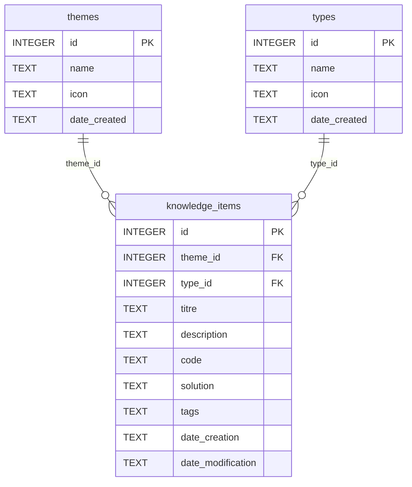

# Spécifications du WebService


[1-Besoin ](#besoin)

[2-Objectif](#objectif)

[3-Les End-Points](#les-end-points)

[4-Schéma relationnel de la base de données](#schéma-relationnel-de-la-base-de-données)    

[5-Liste des types](#liste-des-types)    

[6-Liste des thèmes](#liste-des-thèmes)   

[7-Enregistrer une fiche](#enregistrer-une-fiche)   

[8-Format JSON](#format-json)

[9-Interface utilisateur](#interface-utilisateur)

[10-Lancement du serveur](#lancement-du-serveur)   

[11-Stack et Contraintes techniques](#stack-et-contraintes-techniques)

# Besoin

En tant que développeur Android, pouvoir enregistrer des éléments de
connaissance, pour capitaliser sur les compétences acquises pendant une
phase de développement

# Objectif

2 étapes :

1.  Développer un serveur, en python, qui pourra être exploité grâce à
    une série de end point(voir ci-dessous).

2.  Développer la librairie en kotlin, qui permettra de contacter le
    serveur depuis Android Studio.

# Les End-Points

| Méthode    | Route                          | Description           |
|------------|--------------------------------|-----------------------|
| GET        | `/api/knowledge/themes`        | Get Themes            |
| POST       | `/api/knowledge/themes`        | Create Theme          |
| GET        | `/api/knowledge/types`         | Get Types             |
| POST       | `/api/knowledge/types`         | Create Type           |
| GET        | `/api/knowledge/tags`          | Get All Tags          |
| GET        | `/api/knowledge`               | Get Knowledge Items   |
| POST       | `/api/knowledge`               | Create Knowledge Item |
| GET        | `/api/knowledge/{item_id}`     | Get Knowledge Item    |
| PUT        | `/api/knowledge/{item_id}`     | Update Knowledge Item |
| DELETE     | `/api/knowledge/{item_id}`     | Delete Knowledge Item |


NB: Tous les échanges entre le client et le serveur utilisent le format **JSON**.

> **Note :** L'endpoint `GET /api/knowledge/tags` retourne la liste des tags distincts.
> Le serveur parse les chaînes stockées en base (ex: `"kotlin,compose,state"`)
> pour en extraire et dédupliquer les valeurs individuelles.


# Schéma relationnel de la base de données




> Le champ `tags` est stocké sous forme de chaîne de caractères,
> avec les valeurs séparées par des virgules (ex: `"kotlin,compose,state"`).


# Liste des types


| ID  | Nom              | Icône |
|-----|------------------|-------|
| 1   | Concept          | 📘    |
| 2   | Snippet          | 💻    |
| 3   | Erreur résolue   | 🐛    |
| 4   | Astuce           | 💡    |
| 5   | Question ouverte | ❓    |
| 6   | Objectif         | 🎯    |
| 7   | Ressource        | ✳️    |
| 8   | Piège            | ⚠️    |
| 9   | Procédure        | 📋    |


# Liste des thèmes

| ID  | Nom                  | Icône |
|-----|----------------------|-------|
| 1   | Python Général       | 🔄    |
| 2   | FastAPI              | ⚡    |
| 3   | Android              | 🤖    |
| 4   | Jetpack Compose      | 🎨    |
| 5   | Kotlin               | 🔧    |
| 6   | Réseau & API         | 🌐    |
| 7   | Base de données      | 💾    |
| 8   | Tests                | 🧪    |
| 9   | Dépendances          | 📦    |
| 10  | IDE                  | 🛠️    |
| 11  | Architecture         | 📌    |
| 12  | Outils               | 📌    |
| 13  | IA & LLM             | 📌    |


# Enregistrer une fiche

## Requête HTTP complète

```http
POST http://localhost:8002/api/knowledge
Content-Type: application/json

{
  "titre": "Titre de la fiche",
  "theme_name": "Nom du thème",
  "type_name": "Type de fiche",
  "description": "Description du problème ou concept",
  "code": "Code ou commandes (optionnel)",
  "solution": "Solution ou explication détaillée",
  "tags": "tag1, tag2, tag3"
}
```   
> **Note :** Le client envoie `theme_name` et `type_name` (noms lisibles) plutôt que des IDs.
> C'est le serveur qui résout les IDs correspondants en base, ou crée les entrées manquantes
> à la volée avec une icône par défaut.

## Comportement du web-service

**Création automatique** (logique `get_or_create_theme()` / `get_or_create_type()`, implémentée dans `kb_service.py`) **:**
- Si le thème n'existe pas → Il sera créé automatiquement avec l'icône par défaut 📌
- Si le type n'existe pas → Il sera créé automatiquement avec l'icône par défaut 📄

**Validation :**
- `titre` : **Obligatoire**
- `theme_name` : **Obligatoire**
- `type_name` : **Obligatoire**
- `description` : Optionnel
- `code` : Optionnel
- `solution` : Optionnel
- `tags` : Optionnel

---

# Format JSON

### Champs détaillés

| Champ | Type | Obligatoire | Description | Exemple |
|-------|------|-------------|-------------|---------|
| `titre` | string | ✅ Oui | Titre court et descriptif | "FastAPI - Erreur HTTP 307" |
| `theme_name` | string | ✅ Oui | Catégorie principale | "Python Général" |
| `type_name` | string | ✅ Oui | Type de fiche | "Erreur résolue" |
| `description` | string | ❌ Non | Contexte et problème | "Lors du POST, erreur 307..." |
| `code` | string | ❌ Non | Code, commandes, exemples | "git log --oneline --graph" |
| `solution` | string | ❌ Non | Solution détaillée | "Étape 1: ...\nÉtape 2: ..." |
| `tags` | string | ❌ Non | Mots-clés séparés par virgules | "macos, firefox, permissions" |   
> Pour le `PUT /{item_id}`, tous les champs sont optionnels.
> Seuls les champs fournis sont mis à jour ; les autres conservent leur valeur existante.

### Formatage du texte

**Retours à la ligne :**
```json
"description": "Ligne 1\n\nLigne 2\n\nLigne 3"
```

**Listes :**
```json
"solution": "Points importants :\n- Premier point\n- Deuxième point\n- Troisième point"
```

**Code avec coloration syntaxique (format recommandé) :**

Le champ `code` supporte la syntaxe Markdown avec balises de langage. La balise définit le langage pour la coloration syntaxique :

```json
"code": "```kotlin\nfun greet(name: String): String {\n    return \"Hello, $name!\"\n}\n```"
```

Langages supportés : `kotlin`, `python`, `javascript`, `java`, `sql`, `bash`, `xml`, `json`, etc.

> Si aucune balise de langage n'est fournie, la détection est automatique (rétrocompatibilité).
> Ancien format accepté : `"code": "git log --oneline --graph"` → rendu sans balise, détection auto.

---

# Interface utilisateur

La base de connaissance est consultée via un navigateur Web.

## Panneau latéral

Affiche des statistiques générales :
- Nombre total de fiches
- Nombre de fiches dans le thème sélectionné
- Nombre de fiches dans le type sélectionné
- Nombre de tags distincts

## Barre de filtres

- 2 listes déroulantes : sélection du **Thème** et du **Type**
- 1 liste déroulante : sélection d'un **Tag**
- 1 zone de texte : recherche libre dans le titre et la description

> Le filtrage est effectué côté client, sur la liste JSON chargée en mémoire.

## Liste des fiches

Chaque fiche affiche :
1. Le titre
2. Le thème et le type
3. Les tags sous forme de **badges cliquables** (clic = filtre actif)
4. Un **bouton Modifier**
5. Un **bouton Supprimer**
6. Le champ `code` avec **coloration syntaxique** via **marked.js 4** + **Highlight.js 11.9** :
   - Le contenu du champ `code` est interprété comme du **Markdown**
   - Un bloc de code délimité par des balises ` ```langage ``` ` est rendu avec coloration syntaxique
   - Le langage est détecté **automatiquement** (`hljs.highlightAuto`) si aucune balise n'est précisée (rétrocompatibilité avec les anciennes fiches)
   - Un **Renderer personnalisé** marked.js garantit l'ajout de la classe `.hljs` sur l'élément `<code>`, nécessaire pour que le thème atom-one-dark applique ses couleurs correctement

## Création / Modification d'une fiche

Un bouton **Nouvelle fiche** ouvre un formulaire permettant de saisir :
- Titre *(obligatoire)*
- Thème *(obligatoire)*
- Type *(obligatoire)*
- Description
- Code
- Solution
- Tags


# Lancement du serveur

Un fichier batch Windows (`start_server.bat`) lancera le serveur par double-click   
Le serveur LOCALHOST utilisera le port 8002   
La documentation Swagger sera accessible avec l'url: http://localhost:8002/docs


# Stack et Contraintes techniques

## Environnement
- **Python 3.13**
- **FastAPI** — framework web
- **Uvicorn** — serveur ASGI
- **SQLite3** — base de données (module natif Python, aucune installation requise)
- **python-dotenv** — gestion des variables d'environnement

## Contraintes d'implémentation

### Base de données
- La connexion SQLite doit utiliser `conn.row_factory = sqlite3.Row`
  pour que les résultats soient manipulables comme des dictionnaires.
- La création des tables est gérée par `database/init_db.py`,
  appelé automatiquement au démarrage du serveur via `main.py`.

### Interface web
- L'UI utilise des **URLs relatives** (`/api/knowledge`) pour appeler l'API,
  afin de garantir la cohérence d'origine quel que soit le nom d'hôte utilisé (`localhost` ou `127.0.0.1`).
- Le rendu du champ `code` utilise **marked.js 4** (parseur Markdown) couplé à **Highlight.js 11.9** (coloration syntaxique), chargés depuis CDN :
  - `cdnjs.cloudflare.com` pour Highlight.js (thème `atom-one-dark`)
  - `cdn.jsdelivr.net` pour marked.js
- Un **Renderer personnalisé** (`mdRenderer.code`) est utilisé à la place de l'option `highlight` de marked.js, afin d'ajouter explicitement la classe `.hljs` sur l'élément `<code>` généré — sans quoi le thème atom-one-dark n'applique pas sa couleur de texte par défaut (`#abb2bf`), rendant les tokens non colorés quasi-invisibles sur le fond sombre.
- Les champs `description` et `solution` sont également rendus en Markdown (`marked.parse()`), permettant gras, listes, liens et blocs de code inline.

### Structure des fichiers   


```
web-service-kb/
├── database/
│   ├── init_db.py       ← création des tables SQLite
│   └── kb.db            ← base de données (exclue du Git)
├── models/
│   └── kb_models.py     ← schémas Pydantic
├── services/
│   └── kb_service.py    ← logique métier + accès BDD
├── routers/
│   └── kb_routers.py    ← endpoints FastAPI
├── static/
│   └── kb.html          ← interface web
├── main.py              ← point d'entrée, static files
├── .gitignore
├── requirements.txt
├── .env
└── start_server.bat     ← démarrage du serveur, sous windows
```   
> Les fichiers `.env` (variables d'environnement : chemin BDD, port) et `kb.db` sont exclus du versionnement Git (`.gitignore`).


## Codes HTTP de retour
| Situation           | Code |
|---------------------|------|
| Création réussie    | 201  |
| Suppression réussie | 204  |
| Ressource introuvable | 404 |
| Doublon thème/type (POST /themes ou POST /types) | 400  |


